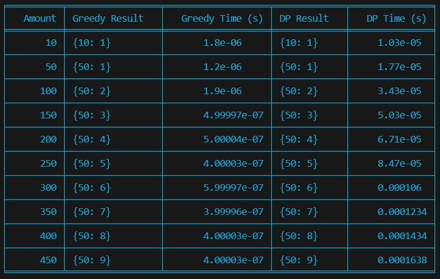

# woolf-algo-hw-09

# Аналіз Ефективності Алгоритмів Видачі Решти

## Огляд Результатів

Таблиця результатів демонструє виконання двох алгоритмів для різних сум від 10 до 450 одиниць. 

Жадібний алгоритм (`Greedy`) та алгоритм динамічного програмування (`Dynamic Programming` або `DP`) порівнювались за такими параметрами:

- **Результати алгоритму**: Опис мінімальних монет, які використовуються для формування вказаної суми.
- **Час виконання**: Час, потрібний для обчислення видачі решти.

## Інсайди:

### 1. Результати алгоритмів:
- Обидва алгоритми консистентно повертають однаковий набір монет для вказаних сум, що вказує на те, що у цьому випадку жадібний алгоритм також є оптимальним.
- Приклади результатів:
  - Для суми 50: обидва алгоритми використовують одну монету номіналом 50.
  - Для суми 450: обидва алгоритми використовують дев'ять монет номіналом 50.

### 2. Час виконання:
- **Жадібний алгоритм** виконується значно швидше порівняно з алгоритмом динамічного програмування, особливо видно при збільшенні суми. Наприклад, для суми 450, час виконання жадібного алгоритму становить приблизно 4x10^-7 секунд, у той час як для алгоритму динамічного програмування — 0.0001638 секунд.
- Ця різниця у часі може бути пов'язана з тим, що динамічне програмування розглядає більшу кількість можливих комбінацій монет перед прийняттям рішення, що забезпечує знаходження оптимального рішення, але займає більше часу.

## Загальний Висновок

- Жадібний алгоритм є ефективним і швидким рішенням для даної системи монет, де менші номінали є кратними більшим. Він ідеально підходить для використання у реальних системах касових апаратів, де важлива швидкість обробки.
- Алгоритм динамічного програмування є важливим у сценаріях, де необхідно знайти абсолютно найменшу кількість монет, особливо коли номінали монет не є кратними один одному. Хоча цей алгоритм і повільніший, він забезпечує більшу гнучкість та точність у видачі решти.
