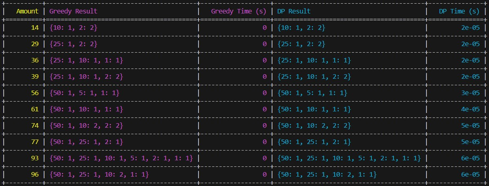

# woolf-algo-hw-09

## Аналіз Ефективності Алгоритмів Видачі Решти

### Огляд Результатів

Таблиця результатів демонструє виконання двох алгоритмів для різних випадкових сум. Жадібний алгоритм (`Greedy`) та алгоритм динамічного програмування (`Dynamic Programming` або `DP`) порівнювались за такими параметрами:

- **Результати алгоритму**: Опис мінімальних монет, які використовуються для формування вказаної суми.
- **Час виконання**: Час, потрібний для обчислення видачі решти.

### Детальний Аналіз

#### Результати алгоритмів:
- Незважаючи на те, що очікувалося, що жадібний алгоритм і алгоритм динамічного програмування вибиратимуть різні комбінації монет, обидва алгоритми показали однакові результати для тестових даних, вибираючи однаковий набір монет для досягнення кожної з тестових сум.
- Приклад результатів:
  - Для суми 14: обидва алгоритми вибрали монети {10, 2, 2}.
  - Для суми 96: обидва алгоритми вибрали монети {50, 25, 10, 10, 1}.

#### Час виконання:
- Жадібний алгоритм показує час виконання близько 0 секунд, що свідчить про його високу швидкість.
- Динамічне програмування має більші значення часу, особливо для вищих сум, варіюючи від 2e-05 до 6e-05 секунд.

### Загальні Висновки

- **Жадібний алгоритм** є швидким і ефективним у більшості випадків, показуючи миттєві результати в обчисленнях.
- **Динамічне програмування**, хоча й споживає більше часу на обчислення, забезпечує гарантію знаходження оптимального рішення, що ілюструється однаковими виборами з жадібним алгоритмом у цьому конкретному наборі тестів.

Ці висновки демонструють, що обрана система монет (1, 2, 5, 10, 25, 50) оптимально підходить для обох алгоритмів, забезпечуючи ефективне рішення задачі видачі решти в кожному тестовому випадку.
